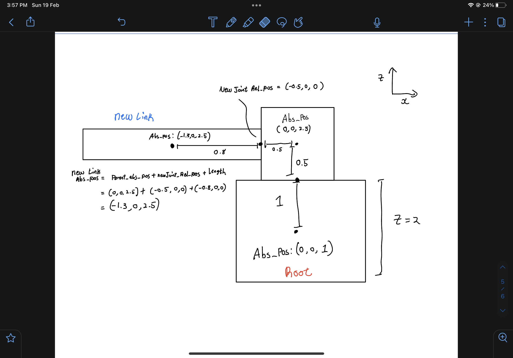

# CS396 HW7: Generate Random 3D Creatures

This assignment creates a program that generates a randomly shaped/sensorized/innervated/motorized 3D creature with a random number of randomly shaped links with random sensor placement along the creature.

Links with and without sensors are respectively colored green and blue.

The video of trials can be seen here: https://youtu.be/Z_HAXOYiN68

# How the program generates random links

The root link and joint are first hardcoded to be generated at x = 0, y = 0, and a random z value according to the link's randomly generated height. Each subsequent link (and therefore its joint) are generated by choosing an existing link as its parent. This means all links are stored (in a list). I check whether any of the 6 sides of the cube are filled (this attribute is updated whenever a link is added to a parent link). If any of the 6 sides are available, I check whether this link can be added without collisions to any other existing links. This is done by a simple 3D collision boundary check. However, there may be collisions to other links. In this case, the dimensions of thie link we are trying to add will be re-randomised and checked for collisions again. If there are no collisions this time, then we can Send_Link(). If we try this 10 times and we continue to get collisions, then (to limit runtime) this joint is re-randomised, meaning we choose another parent or another side of the parent. A collision is shown in the diagram below.


Figure 1: Collision


When adding an non-root link or joint, PyBullet regards the "position" argument as a relative position to its upstream joint. Thus, when generating new links, simply using a new random position and random link size will often lead to new links being generated inside (or a part of it) other existing links. Because of relative positions, we have no knowledge of prior generated blocks' absolute positions. The following diagram demonstrates this issue, where the numbers on each block are the order of generation: 


Figure 2: No information about preceding blocks causes collision

To overcome this, absolute positions of each block are stored. This is hardcoded for the root link and joint. Then, when I create each subsequent link and block pair, the new joint's relative position to its upstream joint is calculated first. The new link's relative position is simply taken from its dimensions. The new link's absolute dimensions, though, are calculated from its parent's absolute position, the new joint's relative position, and the new link's relative position. With the absolute position of each block stored, object collision detection is now quite simple. The absolute position calculation is shown below.


Figure 3: Absolute position calculation using relative positions

This process is repeated until the number of blocks desired has been generated. 


# Running the Program

The main file is search.py. I exclusively used python3.7 for this project.

You can run 1 generation of this randomly shaped creature (generation 0, completely random) with:

``` 

python3.7 search.py 

```

To run this multiple times as in the YouTube video linked above, I ran search.py n times with a bash script: 

```
for ((i=0; i < 10; i++)); do

  python3.7 search.py

done

```

# Citations

Bongard, Josh. “Education in Evolutionary Robotics.” Reddit, https://www.reddit.com/r/ludobots/.

Kriegman, Sam. CS396: Artifical Life, 2023, Northwestern University.

PyBullet, PyBullet, https://pybullet.org. 