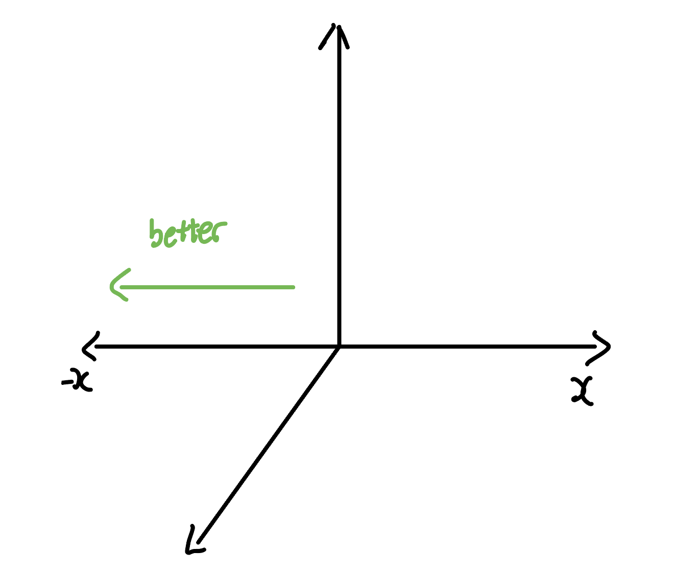
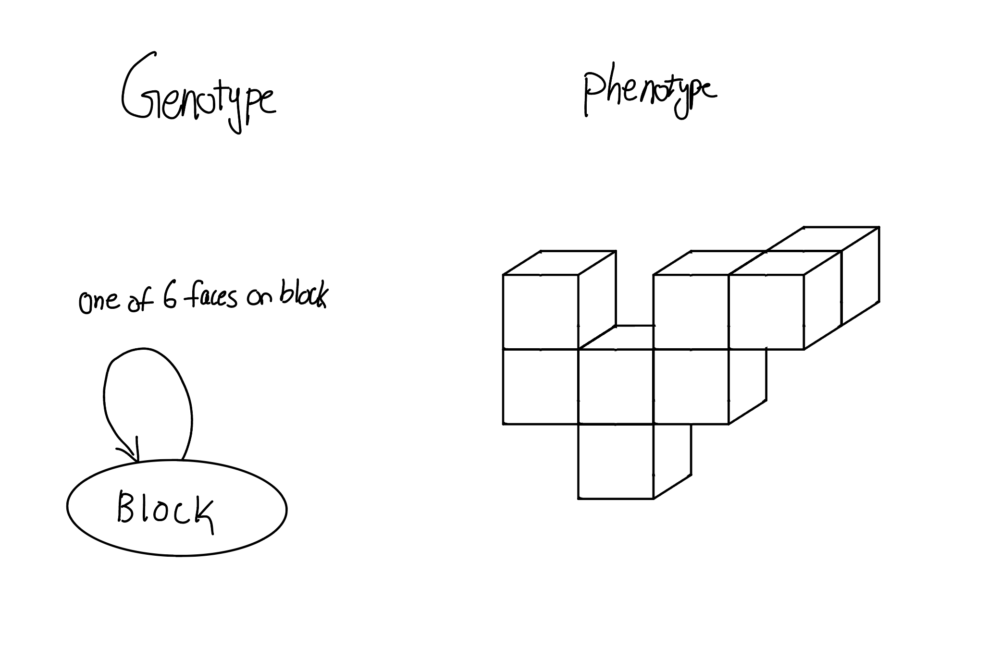
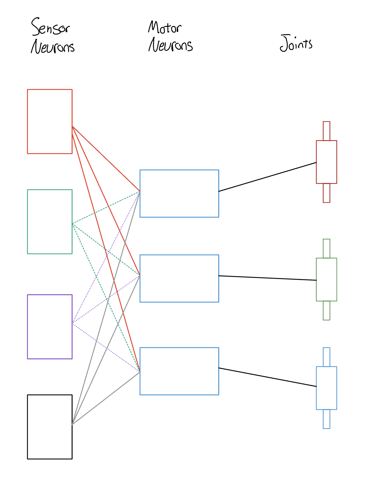
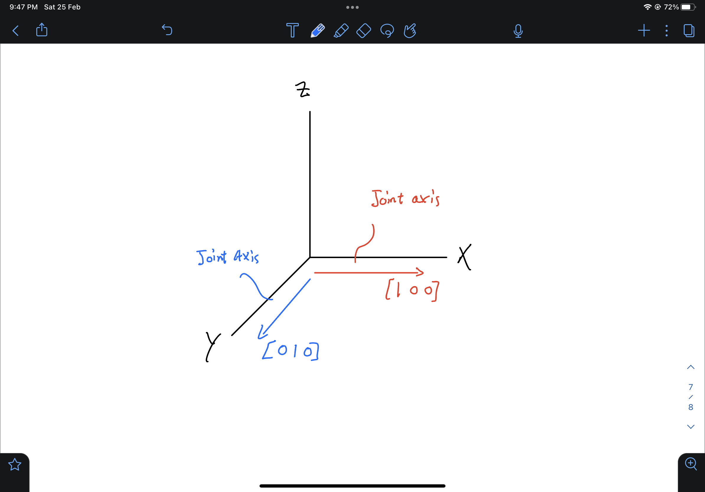
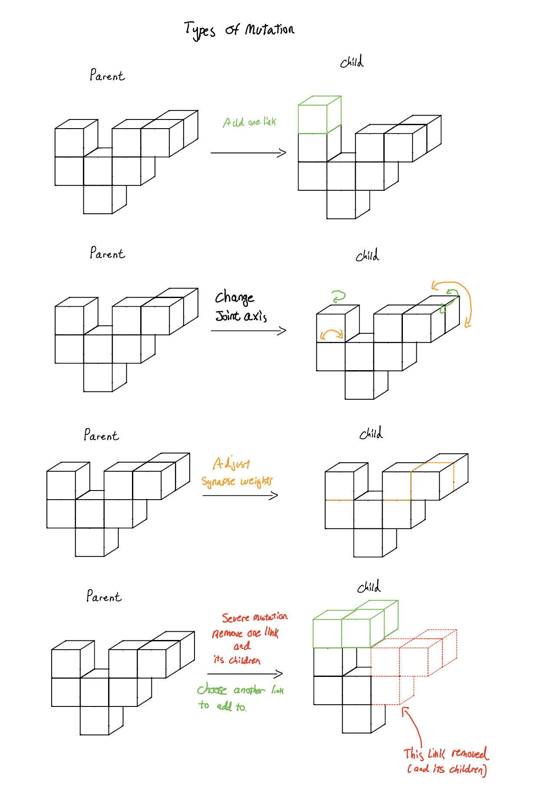
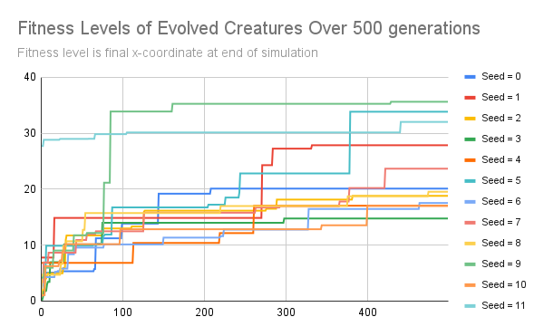
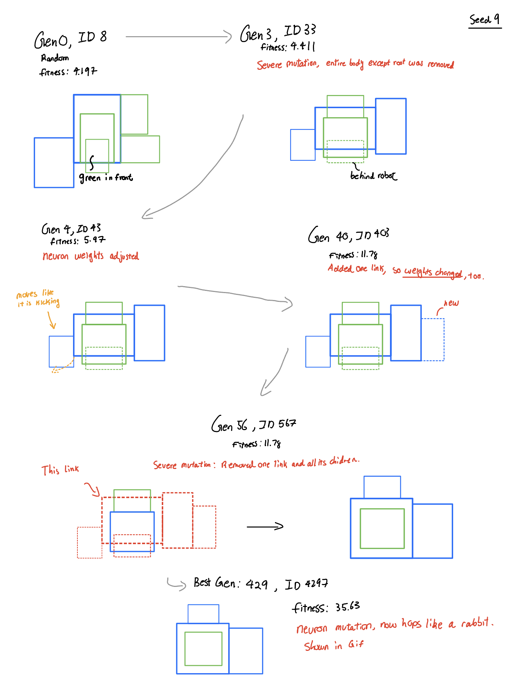
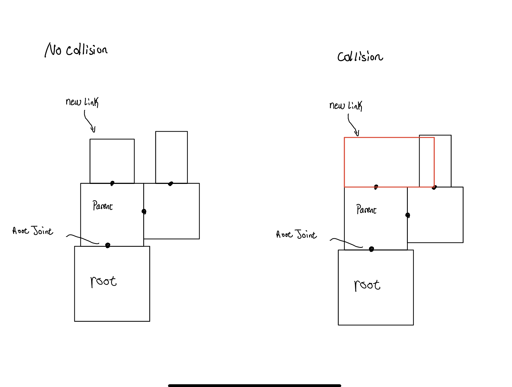
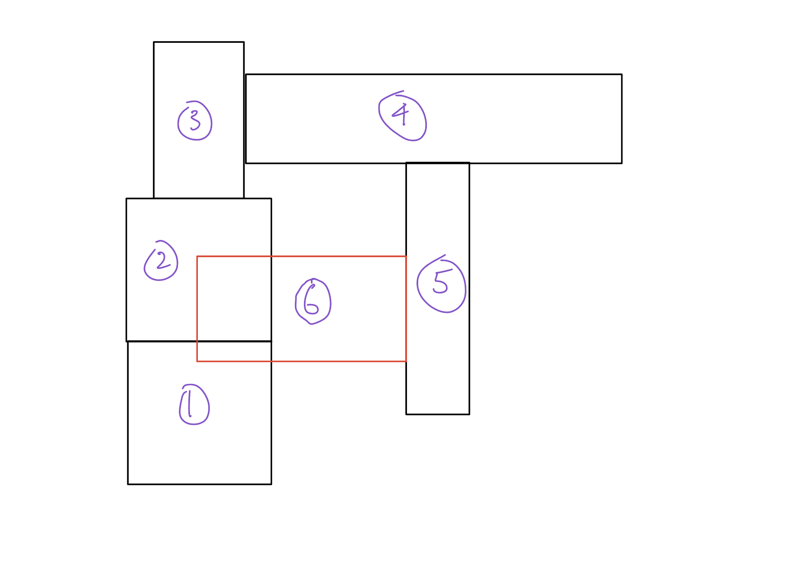
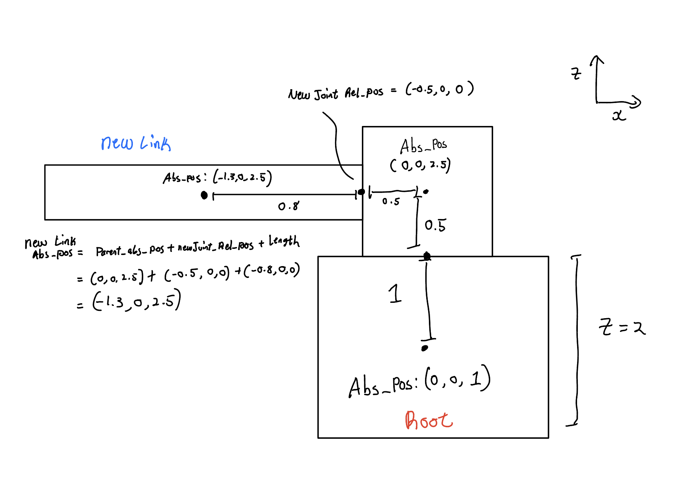

# CS396 Final Project

This assignment creates a program that first generates a random 3D creature with randomised motor/sensor/morphology and uses a mutation function to evolve behavior for locomotion. The program selects for the most fitting creature based on a set fitness function. 

Links with and without sensors are respectively colored green and blue.

# Fitness function 
Each generated creature is placed in a simulation world and its fitness by the end of the simulation is recorded. 

The fitness function for this creature and its ancestors is to minimise the X-coordinate by the end of the simulation. Essentially, it is maximising distance travelled in the negative X-direction. 




Figure 0: Fitness function

# Body Generation
The body is initially generated a randomly generated (shape and size) block. Then, a random series of randomly generated links (blocks) will be added to the root block and each subsequently added block. Figure 1 demonstrates the genotype and possible phenotype of a creature.


Figure 1: Genotype and phenotype of creature

There is a range of sizes allowed for the creature: from 6 to 12. Joints between blocks have randomised axes in the x and y direction. Collision detection is performed such that no unnatural body parts are generated. Collision detection is detailed in Appendix A. 


# Sensor and Motor Connection
In pybullet, links can be sensors and joints can be motorised in their axis of rotation. We can utilise this to help bodies move. Each link is given a random 50-50 chance of being a sensor. Each joint is also given a 50-50 chance of being a motorised joint. The goal of this is to remove any human constructs of where to place sensors and motors and let natural selection occur. Every sensor is also connected to every neuron through a synapse. This is to mimic animal behavior (like when a limb touches something extremely hot, the entire body will move in response, or when moving forward, the left leg steps and the right leg will step in response). However, each synapse is given a different weight, so that different sensors will affect a motor more or less severely. This means that any sensor can have an affect (even negligible) on any motor and, therefore, joint. Figure 3 shows the connections made. 

<!--  -->


Figure 2: Neuron, motor, joint connections on any creature

# Evolution
Evolution occurs by using the parent and applying a mutation function to its body and regenerating it as the child. Then, the child will run through the simulation again and the fitness at the end is recorded. If it has travelled further (smaller X value) than its parent, it will replace the parent as the better creature to be used to evolve off of. 

This program runs 500 generations with 10 parents. Each parent will have a child. As mentioned, if the child performs better, the child will become the new parent that will be the ancestor of subsequent generations. If the child performs worse, the parent remains. 

# Methods: How the program mutates 

The program generates a random creature of initial size [6, 12). The random body generation algorithm is detailed in Appendix A. This section details the mutation function from parent to child generation. 

To mutate, the Mutate() function is called by the parent solution. The Mutate() function randomly selects between 4 different mutation possibilities. Figure 3 graphically depicts the 4 different types of mutations.

1)  Add one link

This mutation adds one link to the creature. To do so, a child link is randomly generated. Then, one link is randomly selected to be the parent link. If all its faces, though, are filled (or if adding to it will go below the ground), another block is randomly selected. A random face of this parent link is selected. If no problems occur (no collisions), then the child link (and its random axis joint) will be added. The link randomly be deemed to have a sensor neuron. An example is shown below depicting the random addition of a link. 

2) Randomising Joint Axis (axes)

The links in the body are connected to each other via *one* joint. There are no ball and socket joints, so each "limb" will have one degree of movement. They are given one of two axes: [0 1 0] or [1 0 0].


Figure 3: Different possible axes

This mutation function iterates through all joints in the creature's body and reassigns one of two axis randomly. They may receive the same axis or a new axis. 

3 ) Change Neuron Weights

This mutate simply randomly mutates neuron weights. Given all the sensor and motor neurons, the synapses are re-generated and are given new random values from [-1,1] and the Create_Brain() function sends these synapses to the simulator with the new weights.

4) One link (and its children, if any) is chosen to be mutated

This is a severe mutation. This mutation chooses one link to be randomly generated. By changing one link, the rest of the link's children will be removed and randomly re-generated. This means the children could be placed back with this parent link or placed with another parent link on the creature's body. However, the number of children to be re-generated can be less than what was removed. This is to mimic random mutations where a feature/trait is removed. The root link may also be selected, so the child could be completely different with no similarities, but as there is only one root link, this possibility is quite low, comparatively.


<!--  -->


Figure 4: Four different types of mutations


# Results

Each trial had 500 generations of 10 parents. Ten trials were run with numpy seeds 0-11. The fitness of the best creatures of each generation were recorded. This can be seen below in Figure 4.



Figure 5: Fitness Levels of Evolved Creatures

There were 4 seeds that stood out: Seeds 1, 5, 9, 11, but the best creature was from seed 9, moving -35.27 units in the x-direction. The resulting creatures all seemed to have the same repeated action that propelled them strictly in the negative x-direction. This makes sense, as this is a simulation with a time limit. Any movements in any direction other than the negative x-direction are wasted movements. This verifies that the selection and the fitness function work well. Due to time and computer performance issues, the trials could not be run for more than 500 generations with 10 children each. With more children, each successful mutation will have a chance of creating a better child along the lineage. Perhaps in the future, this experiment could be run with more generations with more children. 


Here is a gif showing random creatures (the primordial soup) versus selected creatures: 

Here is a video showing each mutation that *improves* fitness for the seed 9 trial: https://youtu.be/ks_uiRRjWQw

Figure 6 is a graphic showing the differences between each mutation that improved the species' fitness levels for the seed 9 trial. 



Figure 6: Mutations that improved fitness levels of seed 9

For seed 9, it seems that up until generation 40, random mutations involving link addition/removal were the mutations that increased fitness. Between Gen 56 and Gen 429, there are increases in fitness, but they are neuron changes, which did not change physical appearance. In other words, once it got to generation 56, which was the last severe mutation, the changes that improved fitness were neuron weight changes. This is interesting, yet not surprising. It seems that the physical characteristics of generation 56, ID 567, had the key to moving as far as possible, but depended on changes to the neuron weights to do so.

I did, however, notice that the changes that eventually enables great improvements in fitness tended to be the severe mutation, where multiple links were removed and replaced with a possiblity of being placed elsewhere on the creature.This is not surprising, as perhaps one phenotype was doomed to begin with. However, while severe mutations are possible in nature (which was my intention: to mimic nature as much as possible), they do occur with much lower probability. If this experiment were performed again, I would decrease the probability of the severe mutation, and also give the other mutations different probabilities to occur. This would be a more realistic simulation of evolution and natural selection. Nonetheless, this experiment proved to be a success, as it was able to evolve a random robot into a creature that is able to run in a certain direction. 

# Video explanation

For a video explanation, see this 2-minute summary video: https://youtu.be/XlnfSwap6eM

The first half is catered for middle schoolers. 

# Running the Program

The main file is search.py. I exclusively used python3 for this project. 

The creatures which increased fitness of the species of each of the 12 seeds has been saved in the directories seed0 to seed11 in this repository. The generation number and ID number of these creatures is recorded in the files increasesInFitness< seedNum >.txt

These creatures that increased fitness can be simulated with the following command: 

```
python3 simulateFromFile.py <seedNum> <creatureID>

```

To run, for example, the best creature of all trials I performed, creature 4297 from Seed 9, I would run: 

```
python3 simulateFromFile.py 9 4297
```

You are, however, not constrained to the trials I have saved in this repository. You can run your own trials of 500 generations with 10 parents using your own random seeds:

```
python3 search.py F <seedNum>
```

(The F stands for do *not* run from existing pickle file)

To change the number of generations and parents, go into constants.py and change the variables ```numberOfGenerations``` and ```populationSize```.

I have saved pickled files from my own seeded trials. The pickle snapshots saved are the generation from which the overall fitness level of the creature increased. The pickled files are saved as seed numbers and generation numbers, which can be found inside each seed's directory. You can re-run these snapshots using the command: 

```
python3 search.py T <seedNum> <genNum>
```


# Citations

Bongard, Josh. “Education in Evolutionary Robotics.” Reddit, https://www.reddit.com/r/ludobots/.

Kriegman, Sam. CS396: Artifical Life, 2023, Northwestern University.

PyBullet, PyBullet, https://pybullet.org. 

# Appendix A: How the program generates random links

The root link and joint are first hardcoded to be generated at x = 0, y = 0, and a random z value according to the link's randomly generated height. Each subsequent link (and therefore its joint) are generated by choosing an existing link as its parent. This means all links are stored (in a list). If any of the 6 sides are available, I check whether this link can be added without collisions to any other existing links. This is done by a simple 3D collision boundary check. 

However, there may be collisions to other links. If so, the link is re-randomised and checked for collisions again. Then, we can Send_Link(). If we try this 10 times and we continue to get collisions, then (to limit runtime) this joint is re-randomised, meaning we choose another parent or another side of the parent. A collision is shown in the diagram below.


Figure A-1: Collision


When adding an non-root link or joint, they are generated relative to its upstream joint. Thus, when generating new links, simply using a new random position and random link size will often lead to new links being generated inside (or a part of it) other existing links. Because of relative positions, we have no knowledge of prior generated links' absolute positions. The following diagram demonstrates this issue, where the numbers on each block are the order of generation: 


Figure A-2: No information about preceding blocks causes collision

To overcome this, absolute positions of each block are stored (hardcoded for root link and joint). When I create each link and block pair, the new joint's relative position to its upstream joint is calculated first. The new link's relative position is simply taken from its dimensions. The new link's absolute dimensions, though, are calculated from its parent's absolute position, the new joint's relative position, and the new link's relative position. With the absolute position of each block stored, object collision detection is now quite simple. The absolute position calculation is shown below.


Figure A-3: Absolute position calculation using relative positions

This process is repeated until the number of blocks desired has been generated. 