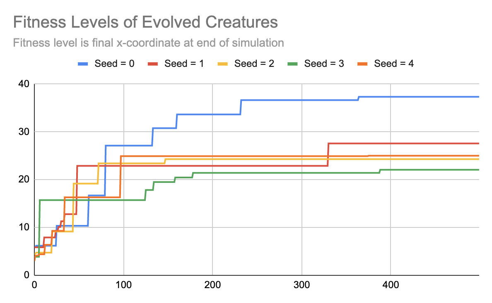
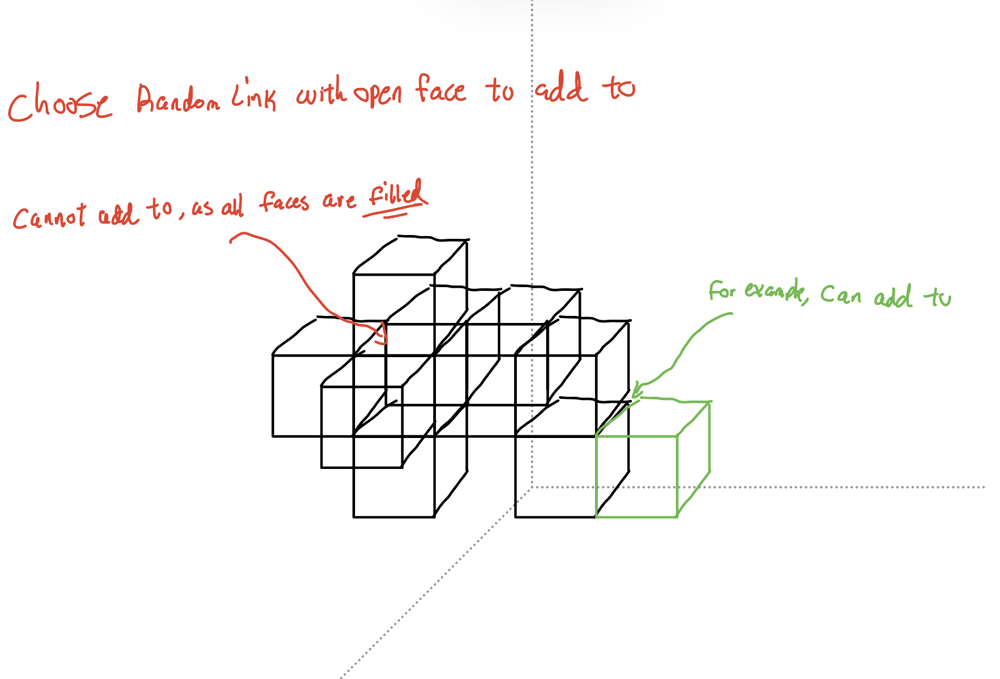
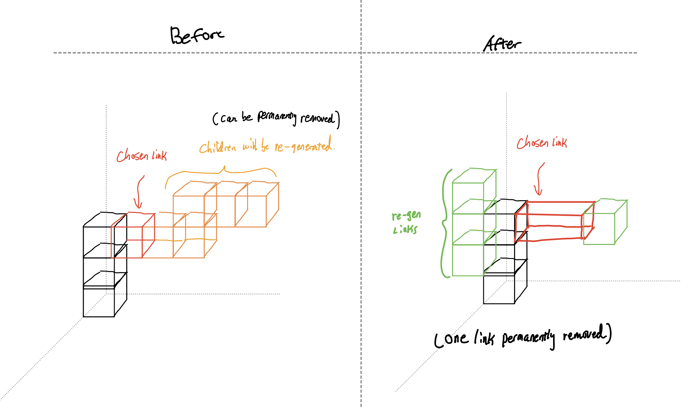

# CS396 HW8: use the parallel hill climber to design morphology and behavior for locomotion.

This assignment creates a program that first generates a random 3D creature with randomised motor/sensor/morphology and uses a mutation function to evolve behavior for locomotion. 

Links with and without sensors are respectively colored green and blue.

# Fitness function 
The fitness function for this creature and its ancestors is to minimise the X-coordinate by the end of the simulation. Essentially, it is maximising distance travelled in the negative X-direction. 

# Evolution
Evolution occurs by using the parent and applying a mutation function to it and regenerating it as the child. Then, the child will run through the simulation and the x-coordinate at the end is recorded. If it has travelled further (smaller X value) than its parent, it will replace the parent as the better creature to be used to evolve off of. 

There are 500 generations of 10 children each. Five trials were run with numpy seeds: [0, 1, 2, 3, 4]. The fitness of the best creatures of each generation were recorded. This can be seen below:


Figure 1: Fitness Levels of Evolved Creatures

The best creature was from seed 0, moving -37.32 in the x-direction.

The video of some trials can be seen here: 


# How the program mutates 

The program generates a random creature of initial size [6, 12). The random body generation is described in branch "assignment7". This section details the brain generation and mutation function from parent to child generation. 

The Brain

The sensor neurons are randomly generated and randomly assigned to any of the creature body's links. The motor neurons are also randomly generated and randomly assigned to any of the creature's body's joints. Then, synapses are created and assigned such that all sensor neurons can affect all motor neurons. This is to mimic animal behavior (like when a limb touches something extremely hot, the entire body will move in response, or when moving forward, the left leg steps and the right leg will step in response). The weights for the synapses are randomly given values from [-1,1]. 

To mutate, the Mutate() function is called by the parent solution. The Mutate() function randomly selects between 4 different mutation possibilities.

1) Change Neuron Weights

This mutate simply randomly mutates neuron weights. Given all the sensor and motor neurons, the synapses are re-generated and are given new random values from [-1,1] and the Create_Brain() function sends these synapses to the simulator with the new weights.

2) Randomising Joint Axis (axes)

The links in the body are connected to each other via *one* joint. There are no ball and socket joints, so each "limb" will have one degree of movement. They are given one of two axes: [0 1 0] or [1 0 0].


Figure 2: Different possible axes

This mutation function iterates through all joints in the creature's body and reassigns one of two axis randomly. They may receive the same axis or a new axis. 

3) Add one link

This mutation adds one link to the creature. To do so, a child link is randomly generated. Then, one link is randomly selected to be the parent link. If all its faces, though, are filled (or if adding to it will go below the ground), another block is randomly selected. A random face of this parent link is selected. If no problems occur (no collisions), then the child link (and its random axis joint) will be added. The link randomly be deemed to have a sensor neuron. An example is shown below depicting the random addition of a link.


Figure 3: Randomly adding one link

4) One link (and its children, if any) is chosen to be mutated

This is a heavy mutation. This mutation chooses one link to be randomly generated. By changing one link, the rest of the link's children will be removed and randomly re-generated. This means the children could be placed back with this parent link or placed with another parent link on the creature's body. However, the number of children to be re-generated can be less than what was removed. This is to mimic random mutations where a feature/trait is removed. The root link may also be selected, so the child could be completely different with no similarities, but as there is only one root link, this possibility is quite low, comparatively.


Figure 4: Randomly selecting one link to mutate


# Running the Program

The main file is search.py. I exclusively used python3.7 for this project.

You can run 500 generations (each with 10 children) of this a randomly shaped creature with:

``` 

python3.7 search.py 

```


# Citations

Bongard, Josh. “Education in Evolutionary Robotics.” Reddit, https://www.reddit.com/r/ludobots/.

Kriegman, Sam. CS396: Artifical Life, 2023, Northwestern University.

PyBullet, PyBullet, https://pybullet.org. 