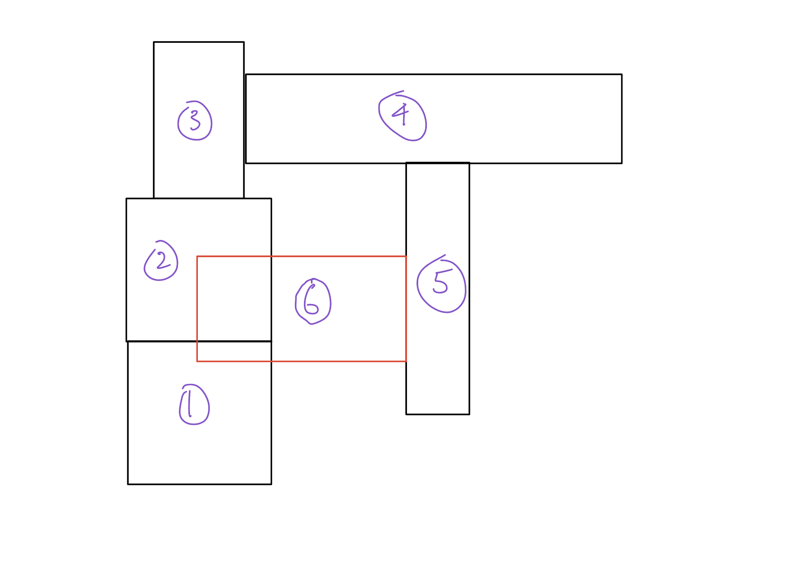

# CS396 HW7: Generate Random 3D Creatures

This assignment creates a program that generates a randomly shaped/sensorized/innervated/motorized 3D creature with a random number of randomly shaped links with random sensor placement along the creature.

Links with and without sensors are respectively colored green and blue.

The video of trials can be seen here: https://youtu.be/Z_HAXOYiN68

# How the program generates random links

When adding an non-root link or joint, PyBullet regards the "position" argument as a relative position to its upstream joint. Thus, when generating new links, simply using a new random position and random link size will often lead to new links being generated inside (or a part of it) other existing links. The following diagram demonstrates this issue, where the numbers on each block are the order of generation: 



To overcome this, absolute positions of each block are stored. Then, when I create each link and block pair, the new joint's relative position is calculated first. Then, 


# Running the Program

The main file is search.py. I exclusively used python3.7 for this project.

You can run 1 generation of this randomly shaped creature (generation 0, completely random) with:

``` 

python3.7 search.py 

```

To run this multiple times as in the YouTube video linked above, I ran search.py n times with a bash script: 

```
for ((i=0; i < 10; i++)); do

  python3.7 search.py

done

```

# Citations

Bongard, Josh. “Education in Evolutionary Robotics.” Reddit, https://www.reddit.com/r/ludobots/.

Kriegman, Sam. CS396: Artifical Life, 2023, Northwestern University.